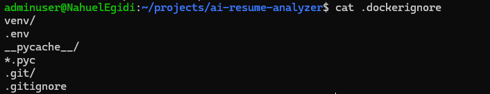
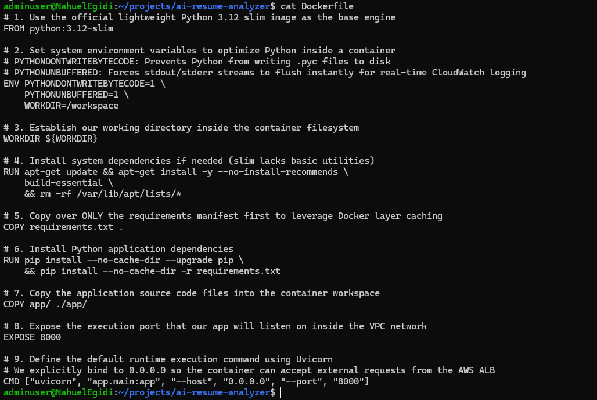
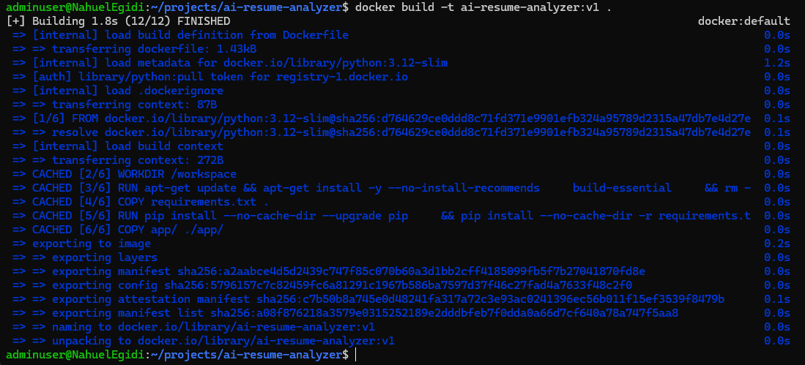
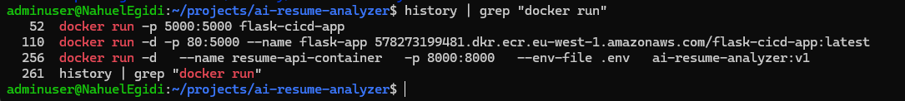
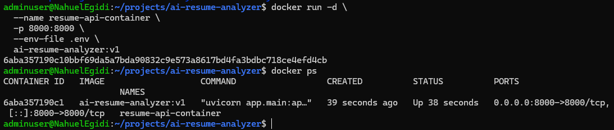
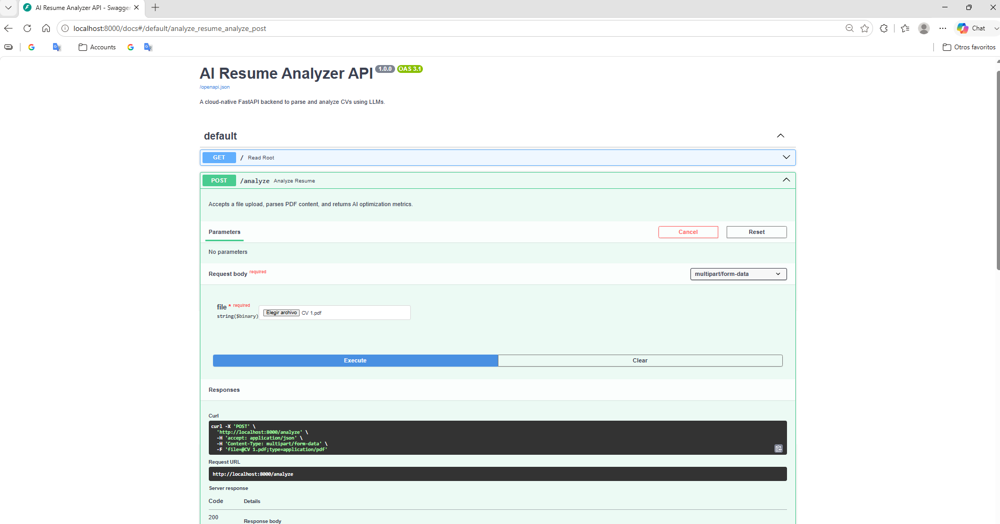
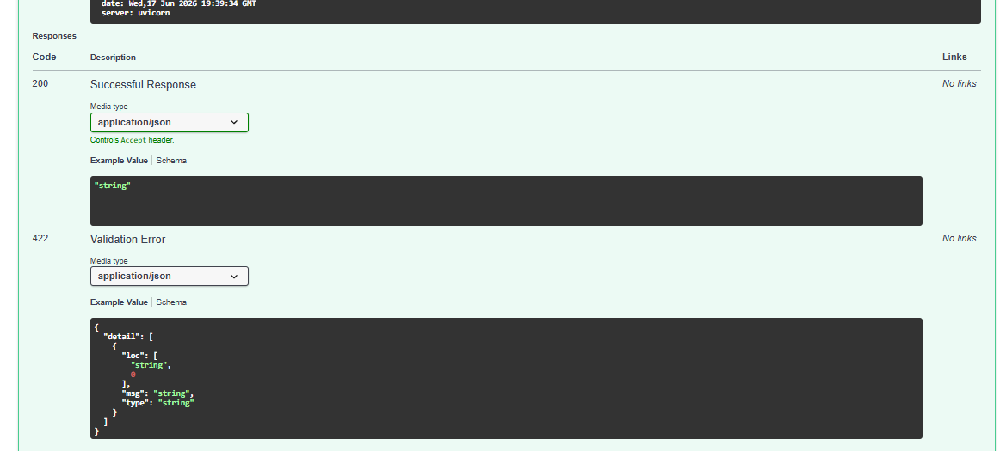

# AI-Resume-Analyzer-on-AWS
This project demonstrates a production-style AI-powered cloud application deployed on AWS using modern DevOps and Infrastructure as Code practices.

The application allows users to upload a resume/CV and receive AI-generated feedback including:

* ATS optimization suggestions
* Skill gap analysis
* Grammar improvements
* Cloud/DevOps career recommendations
* Resume strengths and weaknesses

The project showcases:

* Containerization with Docker
* CI/CD automation with GitHub Actions
* Infrastructure provisioning with Terraform
* AWS cloud deployment
* AI API integration
* Monitoring and logging practices

---

## Architecture Overview

The system follows a modern cloud-native architecture:

- User uploads a resume via API
- FastAPI backend processes the file
- PDF text is extracted
- AI model analyzes the content
- Response is returned to the user
- Infrastructure is deployed using Terraform
- CI/CD automates deployment

📸 **Architecture Diagram**


---

# Live Application

http://YOUR-APPLICATION-URL

---

# Features

* Upload PDF resumes
* AI-powered resume analysis
* Dockerized application
* Automated CI/CD pipeline
* AWS cloud deployment
* Infrastructure as Code with Terraform
* CloudWatch logging
* Secure environment variable handling

---

# Tech Stack

## Backend

* Python
* FastAPI

## DevOps

* Docker
* GitHub Actions
* Terraform

## AWS Services

* ECS Fargate
* ECR
* S3
* IAM
* CloudWatch
* Application Load Balancer

## AI Integration

* OpenAI API

---

# CI/CD Workflow

1. Developer pushes code to GitHub
2. GitHub Actions pipeline starts automatically
3. Docker image is built and tested
4. Docker image is pushed to Amazon ECR
5. Terraform provisions or updates infrastructure
6. ECS Fargate deploys the updated container
7. Application becomes publicly accessible through the Load Balancer

---

# Project Structure

```text
project/
│
├── app/
│   ├── main.py
│   ├── routes/
│   ├── services/
│   ├── templates/
│   └── static/
│
├── terraform/
│   ├── main.tf
│   ├── variables.tf
│   ├── outputs.tf
│   └── provider.tf
│
├── .github/
│   └── workflows/
│       └── deploy.yml
│
├── Dockerfile
├── docker-compose.yml
├── requirements.txt
├── .env.example
└── README.md
```

---

# Local Development Setup

## Clone Repository

```bash
git clone https://github.com/YOUR-USERNAME/YOUR-REPOSITORY.git
cd YOUR-REPOSITORY
```

## Create Virtual Environment

```bash
python -m venv venv
source venv/bin/activate
```

## Install Dependencies

```bash
pip install -r requirements.txt
```

## Configure Environment Variables

Create a `.env` file:

```env
OPENAI_API_KEY=your_api_key
AWS_REGION=your_region
```
## Step 1: Project Initialization (Architecture Setup)

The first step was to initialize the base structure of the FastAPI application. This ensures a clean, modular, and scalable foundation for future development, CI/CD integration, and AWS deployment.

### Project Structure

```text
ai-resume-analyzer/
│
├── app/
│   ├── main.py
│   ├── utils.py
│   ├── templates/
│   └── static/
│
├── requirements.txt
├── .env
└── README.md

## Run Application

```bash
uvicorn app.main:app --reload
```

---

# Docker Setup

## Build Docker Image

```bash
docker build -t ai-resume-analyzer .
```

## Run Container

```bash
docker run -p 8000:8000 ai-resume-analyzer
```

---

# Terraform Deployment

## Initialize Terraform

```bash
terraform init
```

## Preview Infrastructure

```bash
terraform plan
```

## Deploy Infrastructure

```bash
terraform apply
```

---
# Phase 2: Containerization with Docker

## Goal

Containerize the FastAPI application to ensure consistent execution across development, testing, and cloud environments.

Docker allows the application and its dependencies to be packaged into a portable image that can be deployed reliably to AWS ECS later in the project.

---

## Step 1: Docker Build Optimization

Created a `.dockerignore` file to exclude unnecessary files from the Docker build context.

Excluded files:

* Virtual environments
* Environment files
* Python cache files
* Git metadata

### Screenshot



---

## Step 2: Create the Dockerfile

Built a production-ready Docker image using the official Python 3.12 slim image.

Key configuration:

* Python 3.12 runtime
* Dependency installation through `requirements.txt`
* Application source code copied into the container
* Port 8000 exposed
* Uvicorn configured as the application server

### Screenshot



---

## Step 3: Build the Docker Image

Built the application image locally using Docker.

```bash
docker build -t ai-resume-analyzer:v1 .
```

### Screenshot



---

## Step 4: Run the Container

Started the container locally and passed environment variables securely using the `.env` file.

```bash
docker run -d \
  --name resume-api-container \
  -p 8000:8000 \
  --env-file .env \
  ai-resume-analyzer:v1
```

### Screenshot



---

## Step 5: Validate the Containerized Application

Verified that the application was running correctly inside the Docker container.

Checks performed:

* Container status validation
* API accessibility
* Swagger UI functionality
* Resume analysis endpoint testing

```bash
docker ps
```

### Screenshots






---

## Outcome

At the end of this phase, the application was fully containerized and capable of running consistently inside a Docker environment.

### Skills Demonstrated

* Docker
* Containerization
* Image Creation
* Environment Variable Management
* FastAPI Deployment
* Application Packaging
* Local Container Testing

### Next Phase

Deploy the containerized application using cloud infrastructure provisioned with Terraform and AWS services.

# AWS Infrastructure

The following AWS resources are provisioned using Terraform:

* VPC
* Public Subnets
* ECS Cluster
* ECS Service
* ECS Task Definition
* ECR Repository
* Application Load Balancer
* IAM Roles and Policies
* CloudWatch Log Groups
* S3 Bucket

---

# GitHub Actions Pipeline

The CI/CD pipeline automates:

* Docker image builds
* Container testing
* ECR image push
* ECS deployment updates

(Add GitHub Actions screenshot here)

---

# Security Best Practices

* Environment variables stored securely
* Secrets managed with GitHub Secrets
* IAM least privilege permissions
* No hardcoded credentials
* Dockerized isolated environment

---

# Monitoring & Logging

* CloudWatch Logs integration
* ECS service monitoring
* Application logging
* Deployment visibility

---

# Screenshots

## Application UI

(Add screenshot)

## ECS Deployment

(Add screenshot)

## CloudWatch Logs

(Add screenshot)

## GitHub Actions Pipeline

(Add screenshot)

---

# Lessons Learned

During this project I improved my understanding of:

* AWS cloud architecture
* Container orchestration with ECS
* Infrastructure as Code with Terraform
* CI/CD automation workflows
* Secure cloud deployments
* AI API integrations
* Monitoring and troubleshooting cloud applications

---

# Future Improvements

* HTTPS with ACM
* Custom domain with Route53
* Authentication system
* Multi-language resume analysis
* AI interview preparation assistant
* Kubernetes migration
* AWS Bedrock integration

---

# Author

Nahuel Egidi

* GitHub: https://github.com/YOUR-USERNAME
* LinkedIn: https://linkedin.com/in/YOUR-PROFILE
